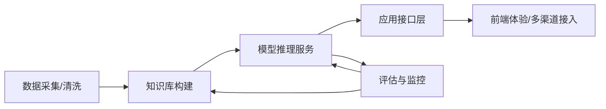

# 架构总览

本文档从工程视角梳理典型大模型应用的技术栈与模块划分，帮助学习者在阅读仓库资料时建立整体认知。

## 端到端流程

1. **数据采集/清洗**：从业务系统、公开数据源收集文本或多模态数据，完成格式统一、脱敏、分段等预处理。
2. **知识库构建**：通过分词、向量化、索引创建等步骤生成检索底座，常见工具包括 FAISS、Milvus、Elasticsearch、PGVector 等。
3. **模型推理服务**：承载大模型推理能力，可选择开源模型（如 LLaMA、Baichuan）或云厂商 API（如 OpenAI、阿里通义千问）。
4. **应用接口层**：结合业务逻辑进行编排，提供 REST/gRPC/WebSocket 等接口，并实现鉴权、限流、日志、审计等能力。
5. **前端体验/多渠道接入**：面向用户的交互层，可覆盖 Web、移动端、企业内部 IM、语音助手等。
6. **评估与监控**：通过人评/自动评估、提示词 A/B 测试、观测指标（延迟、成本、质量）持续迭代。

## 能力模块拆解

| 模块 | 关键职责 | 相关目录 |
| ---- | -------- | -------- |
| 提示词工程 | 设计系统提示、少样本示例、对齐策略 | `01Base/11.提示词工程.md` |
| 框架编排 | 实现链路编排、工具调用、记忆管理 | `02Framework/` |
| 检索增强 | 构建向量索引、混合检索与 rerank 流程 | `03RAG/` |
| Agent 能力 | 工具协议、任务分解、多智能体协同 | `04Agent/` |
| 微调 | 数据构造、训练策略、部署验证 | `05FineTuning/` |
| 行业落地 | 业务流程梳理、端到端集成、合规要求 | `06Project/` |

## 环境与部署建议

- **开发环境**：推荐使用 `conda` 或 `uv` 管理 Python 依赖，Java 项目采用 Maven/Gradle，前端使用 Node.js 18+。
- **容器化**：对推理服务和检索组件使用 Docker Compose 或 Kubernetes 部署，确保弹性扩缩容。
- **配置管理**：敏感凭证使用 `.env` 或密钥管理服务，在代码中通过配置中心读取。
- **可观察性**：结合 Prometheus + Grafana、OpenTelemetry 等方案记录延迟、吞吐、错误率与成本指标。

## 推荐阅读顺序

1. 先在 `docs/learning-path.md` 了解整体学习节奏；
2. 阅读本文档掌握架构蓝图；
3. 按需深入对应目录的专题内容，并结合 `docs/resources.md` 拓展视野。

> 建议在实际项目中形成自己的架构图，并随着需求变更持续维护。
